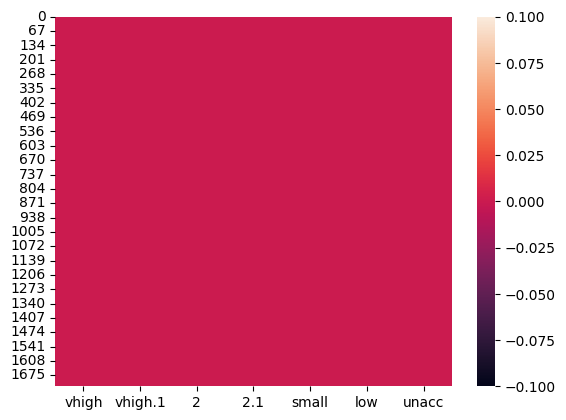
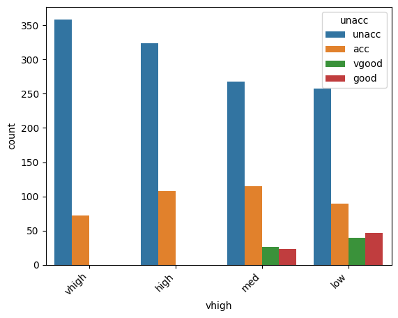
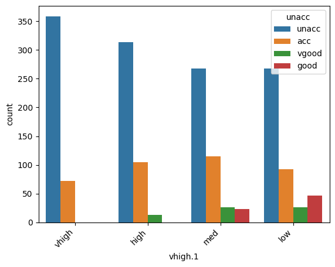
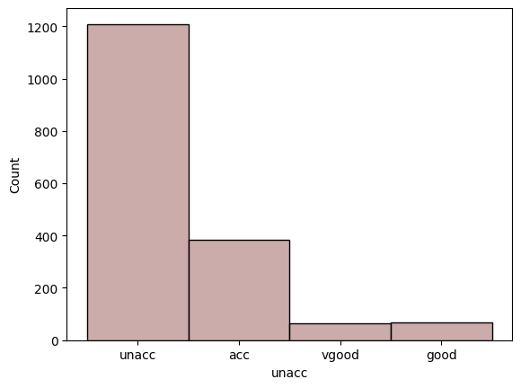
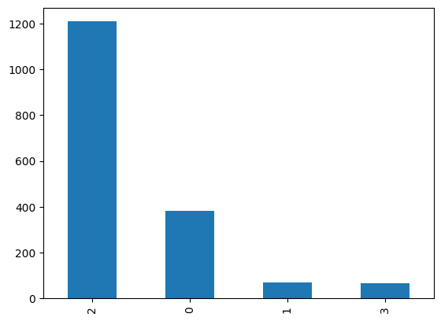
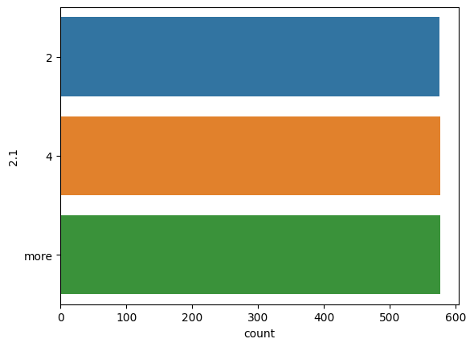
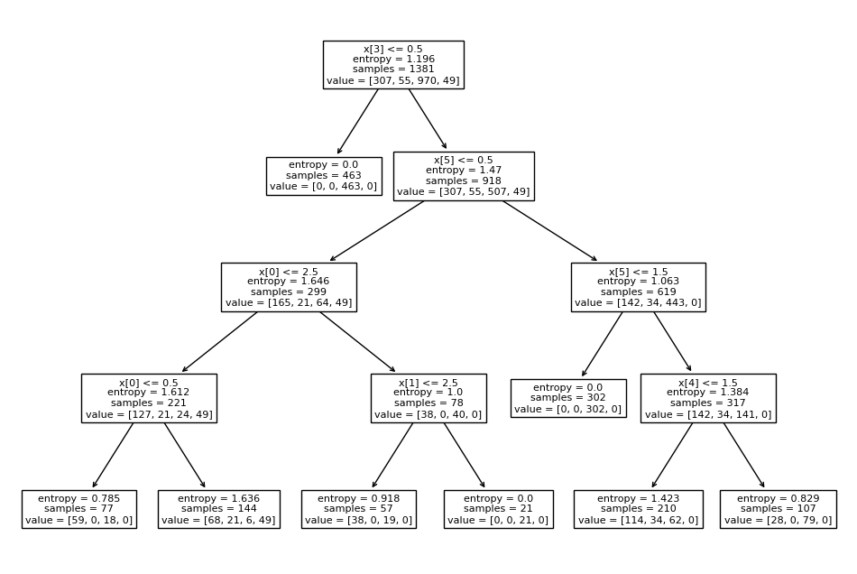
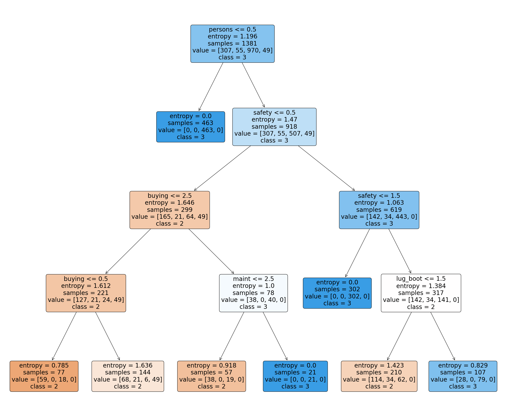

# Laporan Proyek Machine Learning
### Nama : Refadli Dwi Ilham
### Nim : 211351121
### Kelas : Pagi B

## Domain Proyek
Evaluasi Mobil ini bisa digunakan sebagai patokan bagi semua yang ingin mengetahui penilaian kelas yang sesuai dengan kebutuhan konsumen maupun bisnis untuk menjamin kepuasannya
## Business Understanding

Industri otomotif  berkembang seiring dengan perubahan kebutuhan konsumen akan kendaraan pribadi.
Evaluasi kendaraan merupakan aspek penting dalam proses  keputusan kelas yang baik bagi konsumen individu maupun bisnis.
Oleh karena itu, diperlukan suatu metode evaluasi yang komprehensif yang dapat memberikan informasi yang akurat kepada konsumen untuk menjamin kepuasan dan nilai investasi yang optimal.

Bagian laporan ini mencakup:

### Problem Statements

Namun, saat ini ada beberapa masalah pada penilaian mobil.
Konsumen seringkali  kesulitan memperoleh informasi yang lengkap dan terkini mengenai berbagai model kelas kendaraan yang ada di pasaran.
Selain itu, beragamnya kebutuhan dan preferensi konsumen seringkali tidak sesuai dengan rekomendasi yang diberikan oleh sumber informasi otomotif.
Oleh karena itu, Anda memerlukan solusi yang menyederhanakan proses evaluasi kendaraan dan memberikan rekomendasi kelas yang lebih disesuaikan dengan kebutuhan pribadi Anda.

### Goals

Tujuan utama dari proyek evaluasi kendaraan ini adalah untuk menyediakan platform yang dapat memberikan informasi yang akurat dan relevan tentang berbagai kelas model kendaraan yang tersedia di pasar.
Platform tersebut juga bertujuan untuk memberikan pemahaman lebih mendalam mengenai kelas kebutuhan dan preferensi konsumen, sehingga rekomendasi yang diberikan  lebih relevan dan memenuhi harapan konsumen.
Perusahaan juga bertujuan untuk meningkatkan pengalaman pemilihan kelas mobil bagi konsumen dan berkontribusi pada pertumbuhan industri otomotif secara keseluruhan.
    ### Solution statements
    - Pengembangan Platform Pencarian Harga yang cocok untuk membeli atau menjual ponsel Berbasis Web, Solusi pertama adalah mengembangkan platform pencarian Harga yang cocok untuk membeli atau menjual ponsel mengintegrasikan data dari Kaggle.com untuk memberikan pengguna akses cepat dan mudah ke informasi tentang estimasi Harga yang cocok untuk membeli atau menjual ponsel
    - Model yang dihasilkan dari datasets itu menggunakan metode Linear Regression.

## Data Understanding
Dataset yang saya gunakan berasal jadi Kaggle yang berisi Kelas Evaluasi Mobil.Dataset ini mengandung 1726 baris dan 7 columns.

https://www.kaggle.com/datasets/elikplim/car-evaluation-data-set

### Variabel-variabel sebagai berikut:
Buying     = Pembelian
maint      = pemeliharaan
doors      = pintu
persons    = orang
lug_boot   =
safety     = keamanan
class      = kelas
## Data Preparation
# IMPORT DATASET
Berikut ini adalah cara mengimport dataset langsung otomatis dari kaggle tanpa mendownload filenya
```python
from google.colab import files
files.upload()
```
```python
!mkdir -p ~/.kaggle
!cp kaggle.json ~/.kaggle/kaggle.json
!chmod 600 ~/.kaggle/kaggle.json
!ls ~/.kaggle
```
```python
!kaggle datasets download -d elikplim/car-evaluation-data-set
```
```python
!mkdir car-evaluation-data-set
!unzip car-evaluation-data-set.zip -d car-evaluation-data-set
!ls car-evaluation-data-set
```
# IMPORT LIBRARY
Berikut ini adalah library yang saya akan pakai pada projek UAS Mesin Learning kali ini
```python
import numpy as np
import pandas as pd
import matplotlib.pyplot as plt
import seaborn as sns
import pickle
from sklearn.preprocessing import LabelEncoder
from sklearn.model_selection import train_test_split
from sklearn.metrics import classification_report, accuracy_score, confusion_matrix
from sklearn.tree import DecisionTreeClassifier
from sklearn import tree
```
# DATA DISCOVERY
Code ini adalah code untuk perintah "df" agar bisa membaca dataset yang akan digunakan dan menampilkan salah satu datanya
```python
df = pd.read_csv('car-evaluation-data-set/car_evaluation.csv')
df.sample()
```
--------------------------------------------------------------------------------

Code ini adalah untuk menampilkan 5 data teratas dari dataset yang digunakan
```python
df.head()
```
--------------------------------------------------------------------------------

Code ini digunakan untuk menghasilkan ringkasan statistik dari DataFrame dalam pandas,Kolom-kolom yang terlihat adalah statistik deskriptif untuk setiap kolom dalam DataFrame tersebut. Berikut penjelasan singkatnya:

- count: Jumlah total data (observasi) dalam setiap kolom.
- unique: Jumlah nilai unik yang ada dalam setiap kolom.
- top: Nilai yang paling sering muncul dalam setiap kolom.
- freq: Frekuensi kemunculan nilai yang paling sering dalam setiap kolom.

Contoh, pada kolom pertama ("vhigh"), terdapat 1727 data, terdapat 4 nilai unik, nilai "high" paling sering muncul (432 kali), dan frekuensinya adalah 432. Data ini memberikan gambaran umum tentang distribusi dan karakteristik nilai dalam setiap kolom DataFrame tersebut.
```python
df.describe()
```
--------------------------------------------------------------------------------

Code ini digunakan untuk memberikan informasi ringkas tentang DataFrame tersebut. Outputnya mencakup beberapa informasi penting seperti jumlah baris dan kolom, nama kolom, tipe data setiap kolom, serta jumlah nilai yang tidak kosong (non-null) pada setiap kolom.
```python
df.info()
```
--------------------------------------------------------------------------------

Code ini untuk menghasilkan jumlah nilai-nilai yang kosong untuk setiap kolom dalam DataFrame
```python
df.isna().sum()
```
--------------------------------------------------------------------------------

Code ini digunakan untuk menghitung jumlah nilai unik dalam setiap kolom dari DataFrame,Hasilnya adalah serangkaian nilai yang menunjukkan berapa banyak nilai unik yang ada dalam masing-masing kolom DataFrame tersebut.
```python
df.nunique()
```
--------------------------------------------------------------------------------

 Code ini digunakan untuk menghitung jumlah total baris yang merupakan duplikat dalam DataFrame
```python
df.duplicated().sum()
```
--------------------------------------------------------------------------------

Code ini digunakan untuk melihat isi dari DataFrame dari suatu dataset
```python
df
```
--------------------------------------------------------------------------------
# EDA

Code ini digunakan untuk membuat peta panas (heatmap) dari nilai-nilai null (kosong) dalam DataFrame. Setiap sel pada peta panas akan diwarnai sesuai dengan keberadaan nilai null di dalamnya. Jika suatu sel berisi nilai null, maka peta panas akan menunjukkan warna yang berbeda untuk menyoroti kekosongan data tersebut.
```python
sns.heatmap(df.isnull())
```

--------------------------------------------------------------------------------
Code ini digunakan untuk melihat distribusi jumlah data untuk setiap kategori pada variabel 'vhigh', dengan membedakan warnanya berdasarkan kategori pada variabel 'unacc'.
```python
sns.countplot(data=df,x='vhigh',hue='unacc')
plt.xticks(rotation=45, ha='right');
```

--------------------------------------------------------------------------------
Code ini digunakan untuk melihat distribusi jumlah data untuk setiap kategori pada variabel 'vhigh.1', dengan membedakan warnanya berdasarkan kategori pada variabel 'unacc'.
```python
sns.countplot(data=df,x='vhigh.1',hue='unacc')
plt.xticks(rotation=45, ha='right');
```

--------------------------------------------------------------------------------
Code ini digunakan untuk menampilkan perhitungan Unacc (Class) dimana Class 1(unacc) lebih tinggi dari class lainnya
```python
sns.histplot(x="unacc",data=df ,color = 'rosybrown')
```

--------------------------------------------------------------------------------
kode ini mengakses kolom 'unacc' dalam DataFrame, menghitung jumlah kemunculan setiap nilai unik, dan kemudian membuat diagram batang dari hasil tersebut. Diagram batang akan menunjukkan seberapa sering setiap nilai unik muncul dalam kolom 'unacc'.
```python
df['unacc'].value_counts().plot(kind='bar')
```

--------------------------------------------------------------------------------
```python
sns.countplot(data=df,y='2.1')
```

--------------------------------------------------------------------------------
# PREPROCESSING
col_names = ['buying', 'maint', 'doors', 'persons', 'lug_boot', 'safety', 'class']: Membuat sebuah list dengan nama kolom baru yang diinginkan. Setiap elemen dalam list ini akan menjadi nama kolom pada DataFrame.

df.columns = col_names: Mengassign (mengganti) nama kolom pada DataFrame df dengan nama kolom yang baru di definisikan sebelumnya dalam col_names. Dengan kata lain, kolom-kolom pada DataFrame akan diubah sesuai dengan urutan nama kolom yang ada dalam col_names.

col_names: Mengembalikan list yang berisi nama kolom baru setelah diubah pada DataFrame. Ini tidak mempengaruhi DataFrame itu sendiri, tetapi memberikan informasi tentang nama kolom yang baru ditetapkan.
```python
col_names = ['buying', 'maint', 'doors', 'persons', 'lug_boot', 'safety', 'class']

df.columns = col_names

col_names
```
--------------------------------------------------------------------------------
```python
col_names = ['buying', 'maint', 'doors', 'persons', 'lug_boot', 'safety', 'class']

for col in col_names:

    print(df[col].value_counts())
```
--------------------------------------------------------------------------------
```python
le=LabelEncoder()
```
--------------------------------------------------------------------------------
```python
non_numeric_cols=[]
for col in df.columns:
    if pd.api.types.is_numeric_dtype(df[col]):
        pass
    else:
        non_numeric_cols.append(col)
for col in non_numeric_cols:
    df[col]=le.fit_transform(df[col])
```
--------------------------------------------------------------------------------
```python
atribut = ['buying', 'maint', 'doors', 'persons', 'lug_boot', 'safety']
x = df[atribut]
y = df['class']
x.shape, y.shape
```
--------------------------------------------------------------------------------
```python
x_train, x_test, y_train, y_test = train_test_split(x,y, test_size=0.20, random_state=0)
```
--------------------------------------------------------------------------------
# MODELING
```python
dtc = DecisionTreeClassifier(
    ccp_alpha=0.0, class_weight=None, criterion='entropy',
    max_depth=4, max_features=None, max_leaf_nodes=None,
    min_impurity_decrease=0.0, min_samples_leaf=1,
    min_samples_split=2, min_weight_fraction_leaf=0.0,
    random_state=42, splitter='best'
)

model = dtc.fit(x_train, y_train)

dtc_acc = accuracy_score(y_test, dtc.predict(x_test))

print(f"akurasi data training =  {accuracy_score(y_train, dtc.predict(x_train))}")
print(f"akurasi data testing = {dtc_acc} \n")

print(f"confusion matrix : \n{confusion_matrix(y_test, dtc.predict(x_test))}\n")
confusion = confusion_matrix(y_test, dtc.predict(x_test))
print(f"classification report : \n{classification_report(y_test, dtc.predict(x_test))}")
```
```python
input_data = (3,	3,	1,	1,	2,	1)

input_data_as_numpy_array = np.array(input_data)

input_data_reshape = input_data_as_numpy_array.reshape(1,-1)

prediction = model.predict(input_data_reshape)
print(prediction)

if (prediction== 1):
    print("Kelas yang diprediksi adalah 1.")
elif (prediction == 2):
    print("Kelas yang diprediksi adalah 2.")
elif (prediction == 3):
    print("Kelas yang diprediksi adalah 3.")
else:
    print("Kelas yang diprediksi adalah 4.")
```
# VISUALISASI
```python
plt.figure(figsize=(12,8))

tree.plot_tree(dtc.fit(x_train, y_train))
```

```python
fig = plt.figure(figsize=(30,25))
_ = tree.plot_tree(model,
                     feature_names=x_train.columns,
                     class_names=list(map(str, y_train.unique())),
                      filled=True, rounded=True
)
```

# SAVE MODEL
```python
df.to_csv('car-evaluation-data.csv')
```
```python
filename = 'car-evaluation-data.sav'
pickle.dump(dtc,open(filename,'wb'))
```
# EVALUASI
# DEPLOYMENT
